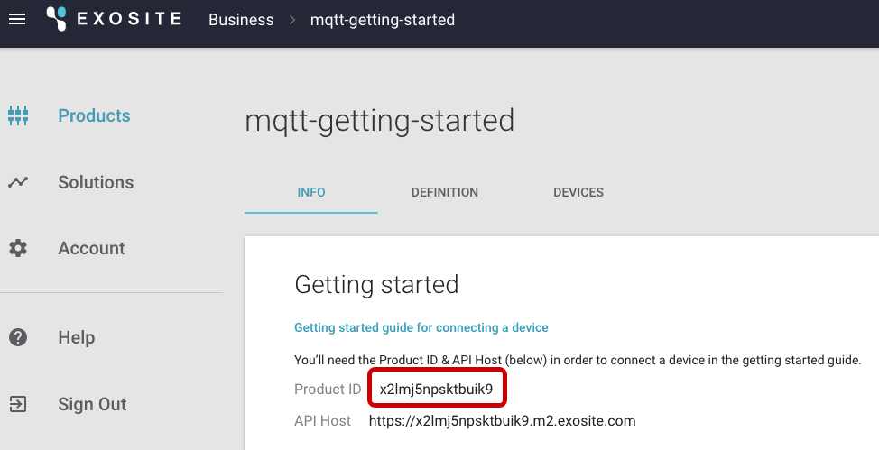
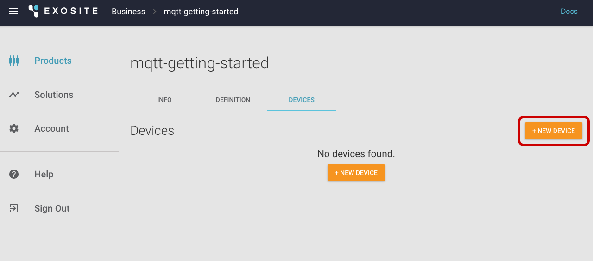
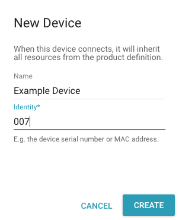
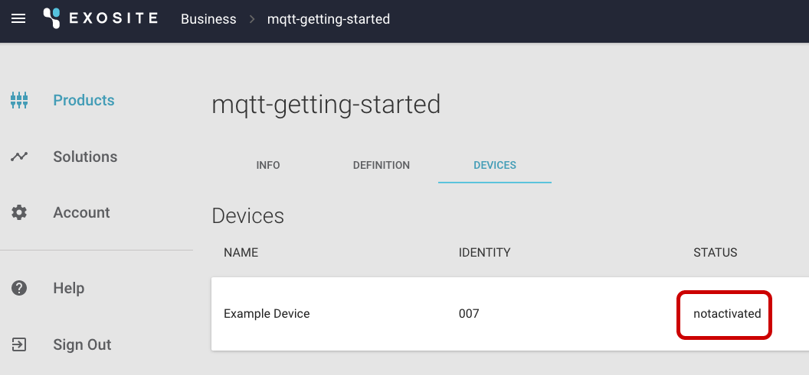
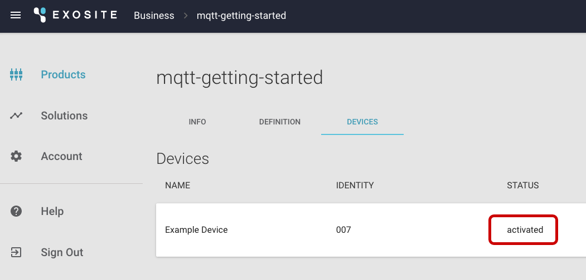
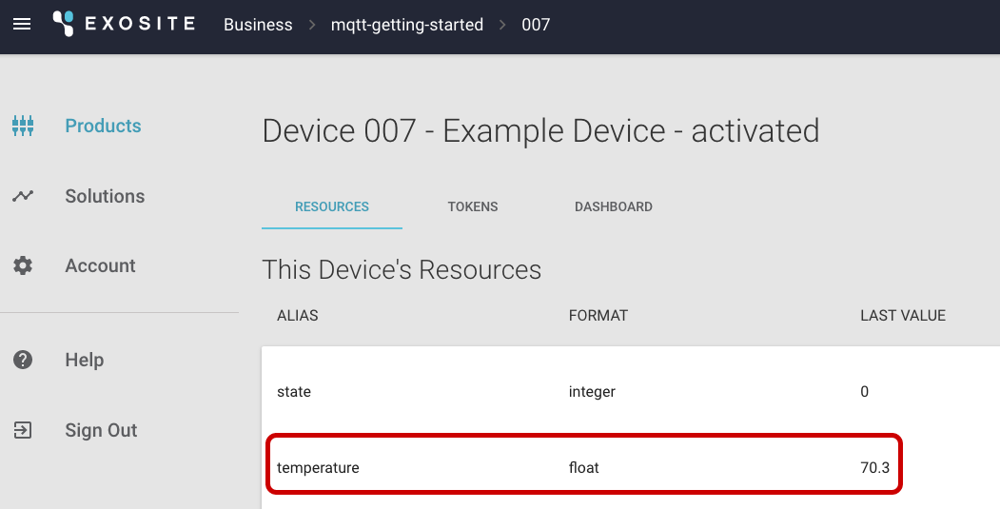
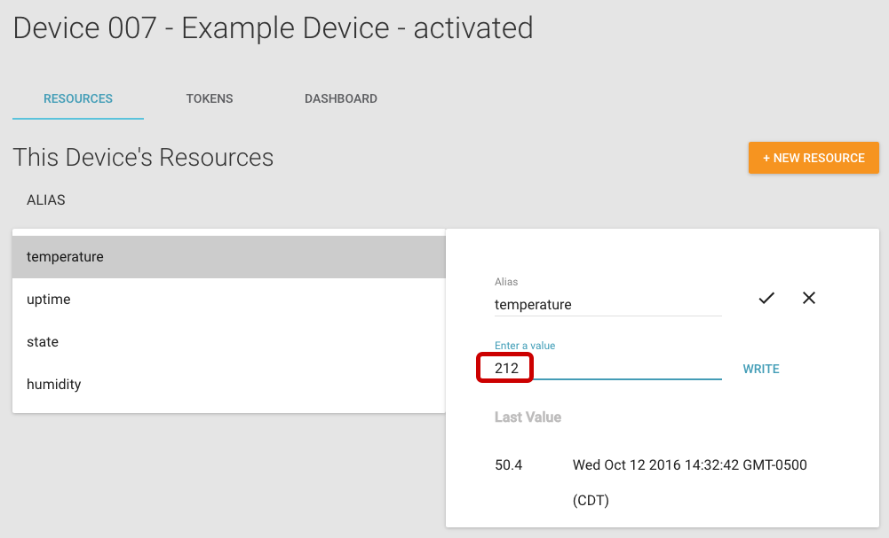

# Getting-started Guide: MQTT

In this guide, you will enable MQTT for your product. You will then activate your device and connect your activated device with the Murano MQTT endpoint.

# Requirements 

## Hardware Setup

No hardware is required to complete this guide.

## Software Setup

To complete this guide, you must first download and install Python 3.5 from the [Python website](https://www.python.org/).

# Overview

Exosite’s MQTT offering supports bi-directional device communication with the Murano Platform using the MQTT protocol. Devices can activate with the Murano Platform, can publish device data to its resources in Murano, and can subscribe to changes made to these resources.

Communication between the device and the Murano MQTT endpoint is secured by SSL and made available on port 8883. Note that Exosite uses [SNI](https://en.wikipedia.org/wiki/Server_Name_Indication). MQTT client libraries are required to support SNI.

Anonymous access is provided only to facilitate device activation. The activation process supplies the device with the credentials necessary to authenticate in future sessions. Access control, by default, limits activated devices to publish/subscribe only to the device’s own resources. Anonymous clients, in contrast, can only publish to an activation endpoint and can only subscribe to that endpoint’s activation reply topic, which is unique to each activation request.

For information about the MQTT protocol, see [http://mqtt.org/](http://mqtt.org/).

# Getting Started

MQTT [client libraries](https://github.com/mqtt/mqtt.github.io/wiki/libraries) are readily available. Exosite requires that the library supports TLS and requires that the TLS support includes SNI. Contact Exosite if a preferred library fails either criteria. The [Eclipse Paho™ MQTT Python Client](https://github.com/eclipse/paho.mqtt.python) is used in the examples below.

## Enable MQTT for Your Product

Contact Exosite to have MQTT enabled for your product. Exosite will request your Product ID, which is available on the *INFO* tab of your product:



## Activate Your Device

Create a device if you have not already done so. 

1. Navigate to the *DEVICES* tab of your product and click the *NEW DEVICE* button:

 

2. Provide an Identity and, optionally, a Name, and click *CREATE*:

 

  The *DEVICES* tab will list the newly-created device and indicate its status is "notactivated."

 

3. Install a patched version of the Eclipse Paho™ MQTT Python Client via the following command:

  `$ pip install git+https://github.com/exosite/paho.mqtt.python.git@openssl_sni_support`

4. Save the following certificate into a file called "trusted.crt":
  ```
  -----BEGIN CERTIFICATE-----
  MIIDVDCCAjygAwIBAgIDAjRWMA0GCSqGSIb3DQEBBQUAMEIxCzAJBgNVBAYTAlVT
  MRYwFAYDVQQKEw1HZW9UcnVzdCBJbmMuMRswGQYDVQQDExJHZW9UcnVzdCBHbG9i
  YWwgQ0EwHhcNMDIwNTIxMDQwMDAwWhcNMjIwNTIxMDQwMDAwWjBCMQswCQYDVQQG
  EwJVUzEWMBQGA1UEChMNR2VvVHJ1c3QgSW5jLjEbMBkGA1UEAxMSR2VvVHJ1c3Qg
  R2xvYmFsIENBMIIBIjANBgkqhkiG9w0BAQEFAAOCAQ8AMIIBCgKCAQEA2swYYzD9
  9BcjGlZ+W988bDjkcbd4kdS8odhM+KhDtgPpTSEHCIjaWC9mOSm9BXiLnTjoBbdq
  fnGk5sRgprDvgOSJKA+eJdbtg/OtppHHmMlCGDUUna2YRpIuT8rxh0PBFpVXLVDv
  iS2Aelet8u5fa9IAjbkU+BQVNdnARqN7csiRv8lVK83Qlz6cJmTM386DGXHKTubU
  1XupGc1V3sjs0l44U+VcT4wt/lAjNvxm5suOpDkZALeVAjmRCw7+OC7RHQWa9k0+
  bw8HHa8sHo9gOeL6NlMTOdReJivbPagUvTLrGAMoUgRx5aszPeE4uwc2hGKceeoW
  MPRfwCvocWvk+QIDAQABo1MwUTAPBgNVHRMBAf8EBTADAQH/MB0GA1UdDgQWBBTA
  ephojYn7qwVkDBF9qn1luMrMTjAfBgNVHSMEGDAWgBTAephojYn7qwVkDBF9qn1l
  uMrMTjANBgkqhkiG9w0BAQUFAAOCAQEANeMpauUvXVSOKVCUn5kaFOSPeCpilKIn
  Z57QzxpeR+nBsqTP3UEaBU6bS+5Kb1VSsyShNwrrZHYqLizz/Tt1kL/6cdjHPTfS
  tQWVYrmm3ok9Nns4d0iXrKYgjy6myQzCsplFAMfOEVEiIuCl6rYVSAlk6l5PdPcF
  PseKUgzbFbS9bZvlxrFUaKnjaZC2mqUPuLk/IH2uSrW4nOQdtqvmlKXBx4Ot2/Un
  hw4EbNX/3aBd7YdStysVAq45pmp06drE57xNNB6pXE0zX5IJL4hmXXeXxx12E6nV
  5fEWCRE11azbJHFwLJhWC9kXtNHjUStedejV0NxPNO3CBWaAocvmMw==
  -----END CERTIFICATE-----
```
5. Save the following code into a file called "activate.py" and run it using “python activate.py”:
  ```
  from paho.mqtt import client as mqtt

  host = "mqtt-"+input("Product ID? ")+".hosted.exosite.io"
  clid = input("Device Identity? ")
  cert = "trusted.crt"
  print

  def on_connect(client, userdata, flags, rc):
    client.subscribe("activate/"+clid)
    client.publish("activate", clid)

  def on_message(client, userdata, msg):
    print("Activation succeeded!")
    print("username = "+clid)
    print("password = "+msg.payload.decode())
    client.disconnect()

  client = mqtt.Client(client_id=clid)
  client.tls_set(cert, server_hostname=host)

  client.on_connect = on_connect
  client.on_message = on_message

  client.connect(host, 8883)
  client.loop_forever()
  ```
**NOTE**: The client connects anonymously using its device identity as its client ID. It immediately (on connect) subscribes to "activate/<device identity>" and publishes an activation request to the topic “activate” with a payload consisting only of its device identity. The “on_message” callback waits for the response and prints the message’s payload, which contains the activated device’s password.

6. Provide your product ID, device identity, and the location of your trusted certificates file (hit <Enter> to accept the listed default file or provide the appropriate location for your operating system/distribution):
  ```
  $ python activate.py
  Product ID? x2lmj5npsktbuik9
  Device Identity? 007

  Activation succeeded!
  username = 007
  password = b7b34f55e948b94841820ea50868a2490632d78f
  ```
A successful result, as shown, activates the device and prints the credentials necessary to subsequently authenticate. You can see the device has been activated:



## Connect Your Activated Device

Use the returned credentials to reconnect. Save the following code into a file called "publish.py" and run it using “python publish.py”:
```
from paho.mqtt import client as mqtt
from time import sleep

host = "mqtt-"+input("Product ID? ")+".hosted.exosite.io"
clid = input("Device Identity? ")
pswd = input("Device password? ")
cert = "trusted.crt"
print

def on_connect(client, userdata, flags, rc):
  client.subscribe(clid+"/#")

def on_message(client, userdata, msg):
  print("Message received!")
  print("topic = "+msg.topic)
  print("payload = "+msg.payload.decode())

client = mqtt.Client(client_id=clid)
client.username_pw_set(clid, pswd)
client.tls_set(cert, server_hostname=host)

client.on_connect = on_connect
client.on_message = on_message

client.connect_async(host, 8883)
client.loop_start()

while True:
  sleep(2)
  topic = input("Topic? ")
  if topic == '':
    break
  msg = input("Message? ")
  (result, mid) = client.publish(topic, msg)
  if result == mqtt.MQTT_ERR_SUCCESS:
    print("Message successfully sent!")
  else:
    print("Failed to send message...")
```
Prompts will be similar to those used to activate. The device’s resources are represented as topics "<device ID>/<resource>" (e.g., “007/temperature”). The client, as part of on_connect, subscribes to all of its resources and, as part of on_message, will echo back whatever it receives. You can publish a temperature value as follows:
```
$ python publish.py
Product ID? x2lmj5npsktbuik9
Device Identity? 007
Device password? b7b34f55e948b94841820ea50868a2490632d78f
Trusted certs file (/etc/ssl/certs/ca-bundle.trust.crt)? 

Topic? 007/temperature
Message? 32
Message successfully sent!
Message received!
topic = 007/temperature
payload = 32
```
The device’s resource’s value will reflect the value published by the device:



Additionally, if you directly enter values in the browser, the device will also receive those changes as messages:



The client will receive a message with the change:
```
Message received!
topic = 007/temperature
payload = 212
```
