# Getting-started Guide: Simulate a Connected Lightbulb Using a Python Script

In this guide, you will use a Python script to simulate a connected lightbulb. You will then create a development dashboard within Murano, where you can see temperature and humidity data from the device and have the ability to remotely turn the lightbulb on and off.

# Requirements

## Hardware Setup

No hardware is required to complete this guide.

## Software Setup

To complete this guide, you must first download and install Python 2.7 from the [Python website](https://www.python.org/).

# Getting Started 

## Create a Product in Murano

In this section, you will create a new Product in Murano.

1. In your browser, navigate to the Murano [Product tab](http://exosite.io/business/products). 

2. To add a Product, click New Product.

  

3. In the *New Product* popup: 

    1. Enter a name for the Product in the *Name* field. 

    2. Select *Connected lightbulb example* from the *Choose starting point* drop-down menu. 

    3. Click Add.  

  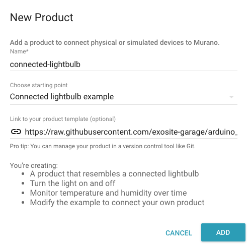

4. Once the Product has been created, navigate to the Definition tab. 

These are the resources your device will interact with. They were created automatically from the product template you selected in the previous step. In this example, the device will generally write data to the uptime, temperature, and humidity aliases, while watching the state alias for changes.

  

## Add a Device in Murano

In this section, you will create and activate a device under your Product in Murano.

5. In Murano, navigate to the Devices tab and click New Device. 

  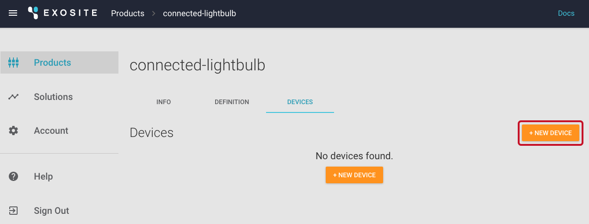

6. In the *New Device* popup: 

    4. Enter a name for the device in the *Name* field. This will only be used to help you distinguish between devices.  

    5. Enter a serial number or device identifier in the *Identity* field. For the purpose of this example, you can use 000001.

    6. Click Create.

  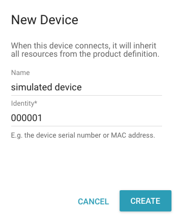

7. Once the device is created, you will see it in your device list with a status of *notactivated*.

  

## Run the Python Device Simulator

In this section, you will use the Python device simulator to activate the new device you created and start simulating data. 

1. Open your OS terminal and clone the Python simulator repo by entering the commands below into the terminal window. Press Enter.
  ```
  git clone https://github.com/exosite/murano_python_device_simulator_example.git
  ```
  ```
  cd murano_python_device_simulator_example
  ```

2. Run the device simulator by entering the command below into the terminal window. Press Enter.
  ```
  python murano_device_simulator.py
  ```
If successful, the script will ask you to enter your Product ID.

  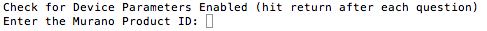

3. Paste your Product ID into the terminal and press Enter. 

  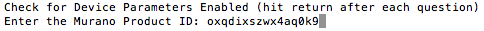

  To find your Product ID:

    1. In Murano, navigate to the Product tab and select the product you just created. 

    2. On the Info tab, locate the Product ID and copy it.

  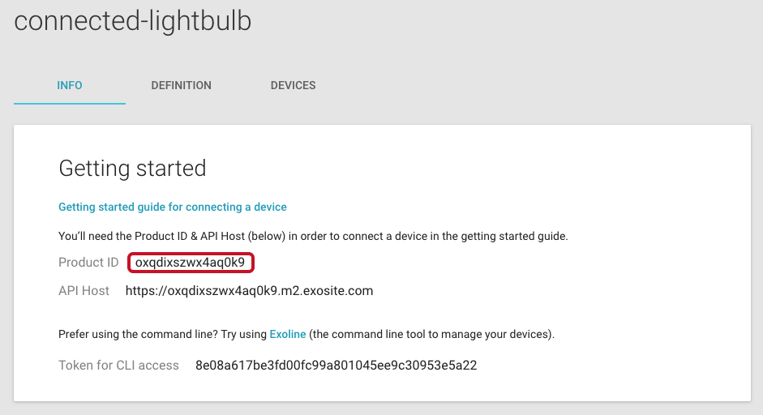

4. Press Enter again to use the default device identity (000001). This matches the identity of the device you added earlier, so it will activate correctly.

  **NOTE:** If you've already added 000001 and simulated the device before, you may need to create a new device (e.g., 000002) and change the default identity on the simulator. This will activate a new device and simulate data for it.

  If the Python Simulator is running correctly, the script should show the device has been activated and whether the lightbulb is on or off. 

  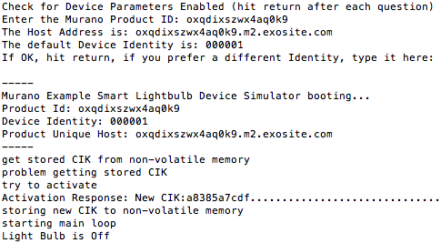

5. Back in Murano, make sure the device shows a status of *activated* on the Devices tab. 

  

6. Click the device and navigate to the Resources tab to ensure data is showing up on the platform. 

  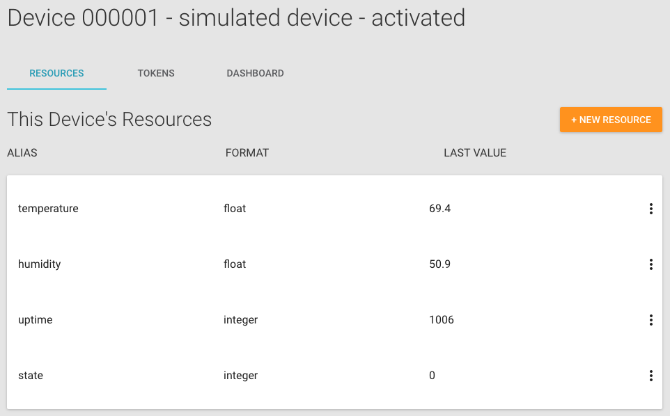

Now you have a simulated device pumping data into Exosite. Keep the simulator running throughout the rest of this guide.

## Create a Dashboard in Murano

In this section, you will create a dashboard to view the data from the connected lightbulb and turn it on and off remotely. 

1. From the Resources tab for your device, open the Dashboard tab. 

  

2. Click Add Pane to house the widgets you will create.

  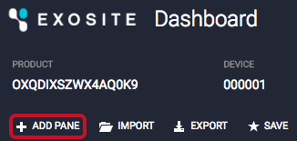

2.  In the pane that appears, click the plus sign to add a widget.  

  

3. In the *Widget* popup that appears, select *Text* from the *Type* drop-down menu and complete the remaining fields (*Title*: Temperature; *Value*: datasources["temperature"]; *Units*: F). Click Save.

  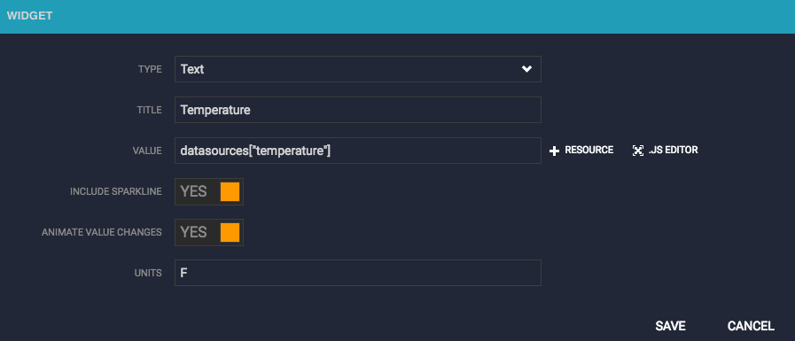

5. Create another pane and text widget for humidity and complete the remaining fields (*Title: *Humidity; *Value:* datasources["humidity"]; *Units:* %). Click Save.

  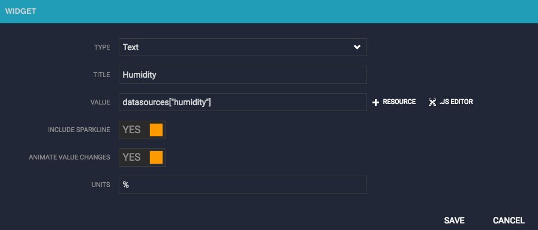

6. Then add a third pane and widget. In the *Widget* popup that appears, select *Toggle Switch* from the *Type* drop-down menu and complete the remaining fields (*Title*: On / Off; *Value*: datasources["state"]; *On Value*: 1; *Off Value*: 0). Click Save.

  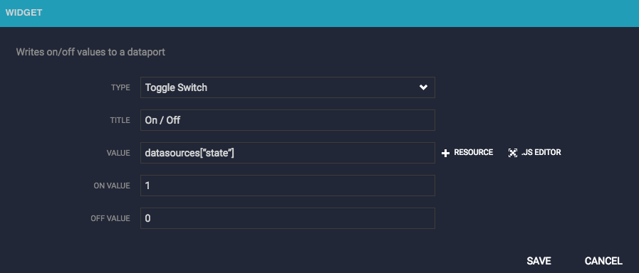

7. Now turn the light on and off for the simulated device using the toggle switch on your dashboard. 

  

Switch to the terminal (while the simulator is running), and you’ll see the simulator indicate that it has received the state changes.

  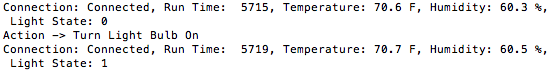

Congratulations—you just remotely turned a simulated device sensor on and off.

[UP NEXT: CREATE A SOLUTION >>](http://beta-docs.exosite.com/murano/get-started/solutions/exampleapp/)

